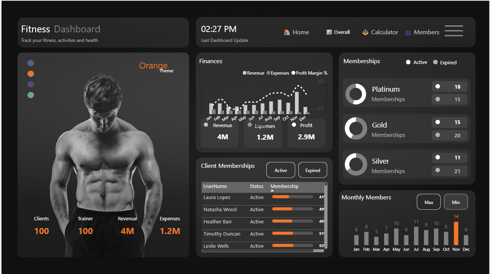

# 💪 Fitness Analytics — Power BI Dashboard

> A polished, themeable analytics dashboard for a fitness business. It surfaces **overall performance**, **monthly trends**, and **membership health**, and includes an interactive **BMI/BMR/TDEE calculator**. Built with clean visuals, thoughtful UX, and portfolio‑ready presentation.

<p align="center">
  
</p>

<p align="center">
  <a href="LICENSE"></a>
  
  
</p>

---

## Table of Contents
- [Overview](#overview)
- [Highlights](#highlights)
- [Report Pages](#report-pages)
- [Data & Model (High Level)](#data--model-high-level)
- [Design System & UX](#design-system--ux)
- [Dynamic Theme Selector](#dynamic-theme-selector)
- [Professional Tooltips](#professional-tooltips)
- [Navigation & Interactions](#navigation--interactions)
- [Getting Started](#getting-started)
- [Repository Structure](#repository-structure)
- [Privacy & Data](#privacy--data)
- [Performance Notes](#performance-notes)
- [Accessibility](#accessibility)
- [Roadmap](#roadmap)
- [Contributing](#contributing)
- [License](#license)

---

## Overview
**Fitness Analytics** is a Power BI solution that turns membership and payment activity into executive‑ready insights. It helps you answer:

- *How are revenue, expenses, and profitability trending?*
- *Are we acquiring and retaining members month over month?*
- *Which tiers (Platinum/Gold/Silver) are healthy vs. at risk?*
- *What’s a member’s daily energy need (TDEE) based on their profile?*

This project demonstrates **enterprise‑grade Power BI practice**: semantic clarity, clean visuals, thoughtful drill paths, data‑driven theming, and informative tooltips—optimized for both decision‑makers and analysts.

---

## Highlights
- **Executive KPIs**: Clients, Trainers, Revenue, Expenses, Profit & Margin with trend indicators.
- **Monthly Performance**: New vs. Expired vs. Net Members; margin trend; optional revenue forecast.
- **Membership Health**: Active/Expired by tier, *Expiring Soon (≤ 30 days)*, retention insights.
- **Member Explorer**: Searchable roster with status icons, Days‑to‑Expiry, progress bars, and drill‑through.
- **Calculator**: Interactive BMI/BMR/TDEE with age/height/weight/activity sliders.
- **Theme Selector**: Switch accent/background (dark/light) via a disconnected color table.
- **Tooltips**: Hover any month → *Revenue by Payment Mode* + *Active vs. Expired by Tier*.
- **Professional polish**: Last Refresh stamp, consistent iconography, and a cohesive visual language.

---

## Report Pages
1. **Home**  
   Brand header, one‑line value proposition, **Last Refresh**, theme selector, and quick headline KPIs for instant context.

2. **Overall**  
   Combo chart (Revenue/Expenses bars + Profit Margin line), monthly members (New, Expired, Net), tier matrix (Active/Expired, Active %), **Expiring Soon** KPI, and core slicers (Trainer, Tier, Gender, Month).

3. **Calculator**  
   BMI gauge with health ranges, BMR/TDEE result cards, sliders for Age/Height/Weight/Activity; optional “use selected member” auto‑fill pattern.

4. **Members**  
   Age/Gender distributions, goal segmentation, and a rich table with status icons, Days‑to‑Expiry, and membership progress; click a member to drill‑through to a profile view.

> Screenshots live under `docs/screenshots/`. A short interaction **demo.gif** is included for recruiters.

---

## Data & Model (High Level)
- **Inputs**: Membership roster and payment transactions.
- **Calendar**: Marked as the date table; used for all time‑based analysis.
- **Theme table**: Disconnected list of brand colors for the theme selector.
- **Star‑style** modeling and single‑direction relationships to keep the model fast and predictable.

> Month labels are sorted by an index to ensure correct chronological order.

---

## Design System & UX
- **Visual Hierarchy**: From hero KPIs to detail cards; whitespace used deliberately.
- **Color**: Single accent color sourced from the theme selector; consistent mapping (e.g., Revenue vs. Expenses vs. Profit).
- **Typography**: Large numeric KPIs, compact labels, accessible contrast.
- **States**: Hover/pressed states on nav, KPI deltas, status icons for memberships.
- **Mobile‑aware**: Layouts respect smaller viewports; optional phone view can be added.

---

## Dynamic Theme Selector
A disconnected color table powers the theme:
- **Accent** applied to titles, labels, and selected series via conditional formatting.
- **Background** can switch **Dark/Light** for brand‑ready variants.
- Ensures visual consistency without hard‑coding colors.

> See `docs/ColorCodes.csv` for an example structure.

---

## Professional Tooltips
A dedicated **report‑page tooltip** enhances context on hover:
- **Revenue by Payment Mode** for the hovered month.
- **Active vs. Expired by Tier** for the same month.
- Optional micro‑cards (Revenue, Active, Expired) for quick reference.

Attach this tooltip page to monthly visuals on **Overall** for a richer narrative without cluttering the canvas.

---

## Navigation & Interactions
- **Top navigation** with page links and active‑page highlighting for an app‑like feel.
- **Slicers** for Month, Membership Tier, Trainer, and Gender; interactions are deliberately scoped.
- **Drill‑through** from tables and charts into Member Profile for focused analysis.

---

## Getting Started
1. **Clone the repo**
   ```bash
   git clone https://github.com/<you>/fitness-analytics-powerbi.git
   cd fitness-analytics-powerbi
   ```
2. **(Recommended) Git LFS for PBIX**
   ```bash
   git lfs install
   # .gitattributes already tracks *.pbix for you
   ```
3. **Open the report**  
   Launch **Power BI Desktop (2024+)** and open `Fitness_Analytics.pbix`.
4. **Sample data (optional)**  
   Point queries to `data/sample/` via **Home → Transform data → Data source settings**.
5. **Explore**  
   Try the theme selector, hover charts to see tooltips, and filter by tier/trainer.

> The included sample data is anonymized for demonstration.

---

## Repository Structure
```
.
├─ Fitness_Analytics.pbix
├─ data/
│  └─ sample/           # anonymized CSV/XLSX for demo
├─ docs/
│  ├─ screenshots/      # home.png, overall.png, calculator.png, members.png
│  ├─ demo.gif          # short interaction clip
│  └─ ColorCodes.csv    # theme selector (optional)
├─ pbix-assets/         # icons, backgrounds (optional)
├─ .gitattributes       # LFS for *.pbix
├─ .gitignore
├─ LICENSE
└─ README.md
```

---

## Privacy & Data
- **No sensitive data** is included. Sample data is fictional/anonymized.
- Keep any private/raw sources outside the repo (`data/private/`, `data/raw/`).
- If sharing screenshots, ensure PII (emails/phones/addresses) is masked.

---

## Performance Notes
- Favor a star schema and single‑direction filters.
- Limit visuals per page to reduce render time; group details behind drill‑through.
- Disable unnecessary interactions; prefer lightweight visuals for large data.
- Use a dedicated Calendar and sort month names by an index.

---

## Accessibility
- Respect color contrast; do not communicate meaning with color alone—use labels/icons.
- Provide text alternatives for key images in **docs/**.
- Ensure keyboard focus order makes sense and slicers have clear labels.

---

## Roadmap
- [ ] Drill‑through **Member Profile** (payments history, progress sparklines)
- [ ] Revenue forecast & scenario **What‑If** controls
- [ ] Mobile layout optimization (phone portrait)
- [ ] Accessibility pass (contrast, alt text, keyboard focus)

---

## Contributing
Contributions are welcome! Please:
- Avoid committing sensitive or proprietary data.
- Keep large binaries tracked with **Git LFS**.
- Use issues/PRs for proposals and enhancements.

---

## License
This project is licensed under the **MIT License**. See [LICENSE](LICENSE) for details.

---

<p align="center">Made with ❤️ for analytics and great user experience.</p>

